# 2026-08-06 — Bottom-anchored search + Liquid Glass map chrome (prototype)

> Prototype branch: `prototype/bottom-search-liquid-glass`, draft PR into `2026-updates`.
> Nothing here is meant to merge as-is — the point is to compare two bottom-search
> shapes in the hand and pick one.

## High-Level Plan

### Problem statement

The map screen's search bar sits under the navigation bar title, eating vertical space at
the top of the one screen where map area matters most. iOS 26 offers two native ways to
move search to the bottom, and they pull the rest of the map chrome in different
directions, so we build both and compare rather than guessing.

Two secondary problems, both visible in the "before" screenshots:

1. **The locate button looks broken.** It's `BRCUserTrackingBarButtonItem`, a vendored
   Route-Me/MapLibre control from 2013. It rasterizes a PNG mask into a bitmap with a
   hardcoded `+2pt` vertical offset (`BRCUserTrackingBarButtonItem.m:247`) and animates
   its own 4pt-radius tinted background (`:262-289`). Under iOS 26 that draws a second,
   squarish backplate *inside* the system's glass capsule, with the arrow visibly
   off-center.
2. **The left-side controls are flat FontAwesome squares** (`BButton`, bootstrap-v3
   styling) that read as stickers next to the Liquid Glass nearby card, and they sit at a
   hardcoded `-50pt` bottom offset that collides with any taller bottom chrome.

### Solution overview

Add a debug-only `MapSearchLayout` preference with three values, switchable at runtime
without a relaunch:

| Layout | What it does |
| --- | --- |
| `navigationBar` | Ships today — `navigationItem.searchController`. The default. |
| `bottomAccessory` | Search field in a `UITabAccessory` above the tab bar. |
| `searchTab` | A `UISearchTab` beside the tab bar; Nearby moves onto the map's card. |

Alongside, rebuild the locate button on SF Symbols and the sidebar controls on glass
circles — both are layout-independent improvements that the bottom layouts need anyway.

### Key changes

- New `MapSearchLayout` enum + `Preferences.UserInterface.mapSearchLayout`, with a
  `.mapSearchLayoutDidChange` notification for live switching.
- `TabController` now owns tab arrangement (`configure(withRootViewControllers:)`),
  replacing the direct `viewControllers =` assignment in `BRCAppDelegate.m`.
- New `MapUserTrackingBarButtonItem` (SF Symbols) replaces the vendored ObjC button.
- `SidebarButtonsView` rebuilt on SF Symbols in `UIGlassEffect` circles.
- Bottom-search machinery under `iBurn/Map/BottomSearch/`.
- Debug picker in the Feature Flags screen.

## Technical Details

### Availability gating

Deployment target is **iOS 16.6** (`iBurn.xcodeproj/project.pbxproj:858,911`); the SDK is
iOS 26.5 (Xcode 26.6). Every iOS 26 API is behind `if #available(iOS 26.0, *)`, and
`MapSearchLayout.resolved` collapses both bottom layouts to `.navigationBar` on older
systems so the preference can never strand a user without a search bar.

Note this codebase uses `#if canImport(FoundationModels)` as an SDK-version proxy in
`NearbyCardView.swift`. That guard is unnecessary here — we're building against the iOS 26
SDK unconditionally — so the new files use plain `#available` checks.

### Files added

| File | Role |
| --- | --- |
| `iBurn/Map/MapSearchLayout.swift` | The enum, storage, and change notification. |
| `iBurn/Map/MapUserTrackingBarButtonItem.swift` | SF Symbol locate button. |
| `iBurn/Map/BottomSearch/MapSearchAccessoryView.swift` | Resting pill inside the tab accessory. |
| `iBurn/Map/BottomSearch/MapSearchInputBar.swift` | Active editable field + Cancel. |
| `iBurn/Map/BottomSearch/MapBottomSearchController.swift` | Orchestrates resting ↔ active. |
| `iBurn/Map/BottomSearch/GlobalSearchTabFactory.swift` | Assembles the `UISearchTab` root. |
| `iBurn/Map/BottomSearch/SearchTabRootViewController.swift` | The VC in the search tab; owns the search controller and the map backdrop. |
| `iBurn/Map/BottomSearch/MapBackdropStore.swift` | Last frame the map drew, for the search overlay. |

`iBurn/` is a `PBXFileSystemSynchronizedRootGroup`, so new files need no pbxproj edits.

### Layout A — `bottomAccessory`

Resting state installs a `UITabAccessory` on the shared tab bar controller:

```swift
tabBarController.setBottomAccessory(UITabAccessory(contentView: accessoryView), animated: true)
```

Installed in `MainMapViewController.viewWillAppear` and torn down in `viewWillDisappear`,
because the accessory belongs to the *tab bar controller* — without the teardown it
follows the user onto Nearby/Favorites/Events. Verified: the accessory is absent from the
Nearby tab's accessibility tree and returns on the Map tab.

Activating swaps to a real editable field. The field is pinned to `keyboardLayoutGuide`
rather than being wired up as an `inputAccessoryView`:

```swift
inputBar.bottomAnchor.constraint(equalTo: host.view.keyboardLayoutGuide.topAnchor)
```

The results view reuses the existing `GlobalSearchHostingController`, added as a child of
the **map** view controller specifically because that class resolves its push target via
`parent?.navigationController` (`GlobalSearchHostingController.swift:59-64`) — parenting
it anywhere else silently breaks result taps.

#### Two layout bugs found and fixed by measuring

Both showed up as the same symptom (results list clipped mid-row after ~115pt) and neither
was guessable from the screenshot. Logging the actual frames gave the answer immediately:

```
hostView={{0,0},{440,956}} results={{0,116},{440,115}} inputBar={{0,231},{440,642}} kbGuide={{0,873},{440,83}}
```

1. **The input bar was 642pt tall.** `results.top` was pinned to the safe area and
   `inputBar.bottom` to the keyboard guide, but nothing fixed the *split* between them.
   The bar's internal stack is pinned top and bottom, so it happily stretches while the
   48pt capsule stays centered inside it — the height was never content-driven. Fixed by
   tying the bar's height to its capsule:

   ```swift
   heightAnchor.constraint(equalTo: capsule.heightAnchor, constant: 16)
   ```

2. **SwiftUI double-counted the keyboard.** The results view already sits entirely above
   the keyboard, so SwiftUI's automatic keyboard avoidance inset the list a second time.
   Fixed with `resultsController.safeAreaRegions = .container` (iOS 16.4+), which excludes
   `.keyboard` from what the hosting controller passes into SwiftUI.

### Layout B — `searchTab`

Requires migrating from `viewControllers` to the `tabs` API (iOS 18+):

```swift
let searchTab = UISearchTab { _ in
    GlobalSearchTabFactory.makeSearchTabRoot(dependencies: BRCAppDelegate.shared.dependencies)
}
searchTab.automaticallyActivatesSearch = true
```

`UITab.init(title:image:identifier:viewControllerProvider:)` reads title and image off each
root's `tabBarItem` — `UINavigationController` forwards `tabBarItem` to its root view
controller, which is why the existing `BRCAppDelegate` setup carries over unchanged.

A `UISearchTab` expects its view controller to own a `UISearchController` on its navigation
item; that's what UIKit morphs the tab bar into. `GlobalSearchTabFactory` wires one up with
results rendered inline (`searchResultsController: nil`) so the list is visible the whole
time the field is focused. `UISearchController.searchResultsUpdater` is a **weak**
reference, so the updater is retained via associated object.

Because the search tab costs a slot, **More is dropped from the tab bar** and reappears as
an `ellipsis.circle` item in the map's navigation bar, presenting `MoreViewController` as a
sheet with an explicit Done button.

### Live switching

`MapSearchLayout.current`'s setter posts `.mapSearchLayoutDidChange`; both `TabController`
and `MainMapViewController` observe it and rebuild. Verified in the simulator: switching
between all three layouts takes effect immediately, no relaunch.

One rough edge found and fixed during testing: switching to `.searchTab` while standing on
the More tab dropped the user into the search field, because the previously-selected root
no longer exists in the new arrangement. `TabController.applySearchLayout` now falls back
to the Map tab.

### Sidebar + nearby card repositioning

Both were pinned to layout margins with hardcoded offsets. They're now pinned to
`view.safeAreaLayoutGuide.bottomAnchor`, which makes them lift automatically when the tab
accessory grows the safe area — confirmed visually: both the nearby card and the control
column moved up ~47pt when the accessory was installed, with no layout-specific code.

## Verification

- `xcodebuild -scheme iBurn` — success, 0 errors, 0 warnings.
- `xcodebuild test -scheme iBurnTests` — **213 passed**, 0 failed.
- Driven in the simulator (iPhone 17 Pro Max, iOS 26.5) through all three layouts:
  resting state, activation, typing a query with live results, cancel, and tab switching.

### Not verified

**The keyboard-up state was never captured visually.** The simulator persistently reverted
to hardware-keyboard mode after the first `type_text` call, and `⌘K` automation is blocked
by Accessibility permissions. The `keyboardLayoutGuide` constraint itself *was* confirmed
numerically (bar bottom = 873pt = guide top), and the SwiftUI double-inset fix addresses
the known failure mode, but someone should tap the field on a real device or a
freshly-restarted simulator and confirm the field rides the keyboard.

## Screenshots

| Bottom accessory (resting) | Bottom accessory (active) |
| --- | --- |
| 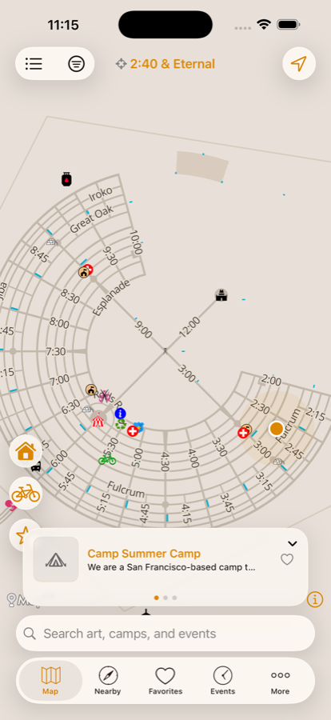 | 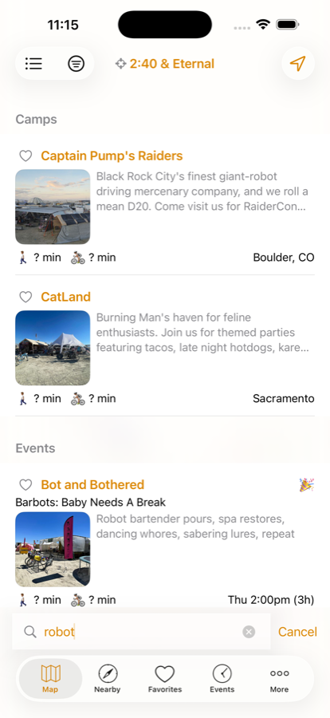 |

| Search tab (resting) | Search tab (active) |
| --- | --- |
| 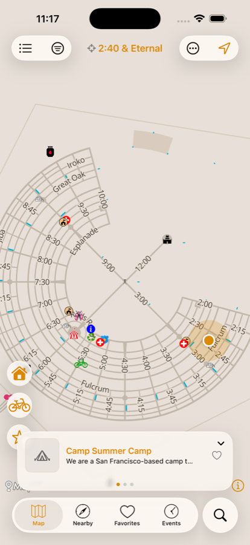 | 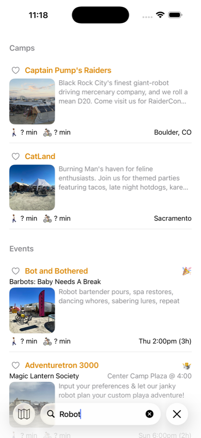 |

## Round 2 (2026-08-07) — `searchTab` picked, three follow-on changes

Chris picked `searchTab` and asked for three things, all now built. The other two layouts
still work; `bottomAccessory` inherits the overlay treatment for free.

### 1. Nearby card moved to the top

`setupNearbyCard` pins to `view.safeAreaLayoutGuide.topAnchor` instead of the bottom.
Search now owns the bottom of the screen and the two were competing for the same corner —
the card is something you read, not something you reach for.

Knock-on: the sidebar column no longer has to clear the card, so it dropped from `-84` to
`-40` off the safe-area bottom. Not to `-12`, which is what it looked like it wanted —
that put the "drop a pin" button on top of MapLibre's attribution, which has to stay
legible. Caught in the first screenshot pass.

### 2. Nearby gives up its tab, not More

Previously the search tab displaced More, which then lived as an `ellipsis.circle` on the
map — reachable only from the Map tab, and called out at the time as the weakest part of
the design. Inverted: **Nearby** gives up the slot instead, because the map already shows
what's around you and the card can carry a link to the rest. More has no equivalent second
entry point, so it keeps its tab.

`TabController.nearbyRootIndex` finds the Nearby root by type
(`NearbyListHostingController` / `NearbyViewController`) rather than by index, so
reordering the tabs in `BRCAppDelegate` can't silently drop the wrong one.

The card gained two affordances, both only when the Nearby tab is absent
(`NearbyCardHostingController.showsNearbyListLink`, set from
`MainMapViewController.applySearchLayout`):

- **"See all ›"** in the card footer, overlaid on the page dots via a `ZStack` so the dots
  stay optically centered whether or not the link is there.
- **A `list.bullet` FAB when nothing is nearby.** The card used to collapse to zero size
  when the item list was empty, which with no Nearby tab would leave no way in at all. The
  glyph is deliberately different from the minimized-card FAB (a badged `mappin.and.ellipse`)
  because they do different things: this opens the list, that restores the card you collapsed.

Both push through `BRCAppDelegate.createNearbyViewController()`, so the pushed screen still
honors the SwiftUI-lists feature flag rather than hardcoding one of the two implementations.

### 3. Search overlays the map instead of covering it

`GlobalSearchView` gained an `isOverlay` flag. The prompt, loading, and no-results states
stay fully transparent; only an actual list of results paints a `.regularMaterial` backdrop
behind itself. Rows get `listRowBackground(.clear)` and the list gets
`scrollContentBackground(.hidden)` so there's one material, not one per row. Default is
`false`, so the existing search screen is byte-for-byte unchanged.

Placeholder text sitting directly on the map is hard to read, so in overlay mode those
states get a small rounded `.regularMaterial` panel. That keeps them legible without a
full-screen background undoing the point.

`MapBottomSearchController` lost its full-screen `UIVisualEffectView` backdrop entirely —
that blur was the thing making the accessory layout opaque, and the same rule now covers it.

#### The part that needed real work: `UITabBarController` unloads the map

Making the search tab transparent revealed **white, not the map** — the tab bar controller
removes the outgoing tab's view, so there is genuinely nothing behind the search tab. No
amount of clearing backgrounds fixes that; the map isn't in the hierarchy.

Rather than stand up a second `MLNMapView` purely as wallpaper, the map hands over a still
of itself on the way out (`MapBackdropStore`, captured in `MainMapViewController.viewWillDisappear`
while the view is still in the window) and `SearchTabRootViewController` paints it
underneath. **`drawHierarchy(in:afterScreenUpdates:false)` does capture MapLibre's rendered
content** — verified on screen, not assumed, since Metal-backed layers often snapshot blank.

Two details worth keeping:

- It captures `mapView`, not `view`. Capturing the whole view controller froze the nearby
  card and sidebar into the picture, putting dead, tappable-looking controls under the
  search field.
- The backdrop refreshes in both `viewWillAppear` and `viewDidAppear`, because the ordering
  of the outgoing tab's `viewWillDisappear` against the incoming tab's `viewWillAppear`
  isn't guaranteed. Whichever lands second gets the fresh frame; the other shows the
  previous one rather than flashing empty.

A frozen frame is honest here — the map isn't live while you're typing either way. It is
still a still image, and that's the one thing to look at critically when judging this.

The search controller moved from the hosting controller to `SearchTabRootViewController`'s
navigation item, since that's now the view controller UIKit reads from.

### Verified this round

Driven in the simulator (iPhone 17 Pro Max, iOS 26.5):

- Map resting: card at top with "See all", tab bar = Map / Favorites / Events / More +
  detached Search. Nearby tab absent.
- Search: empty (map behind, glass prompt panel), no-results, and a live `robot` query
  showing results on material.
- "See all" pushes the full Nearby screen onto the map's stack — back button, distance
  stepper, All/Art/Camps/Events filters all intact.
- Switched to `bottomAccessory`: Nearby tab returns, Search tab disappears, card drops its
  "See all", and the accessory search overlays the live map. Switched back, no relaunch.
- `xcodebuild -scheme iBurn` clean; `iBurnTests` 213 passed, 0 failed.

Known rough edge: switching layout while standing on the More tab lands you on Map.
`UITab`'s view controller provider is lazy, so the outgoing selection isn't found in the new
`viewControllers` yet and the Map fallback takes over. Harmless for a debug preference.

Still unverified from round 1: the keyboard-up state has never been captured visually — the
simulator reverts to hardware-keyboard mode after the first synthetic keystroke.

### Round 2 screenshots

| Map (card at top) | Search, empty | No results |
| --- | --- | --- |
| 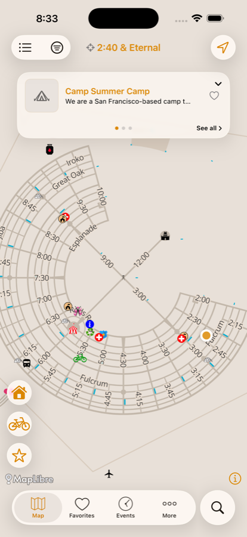 | 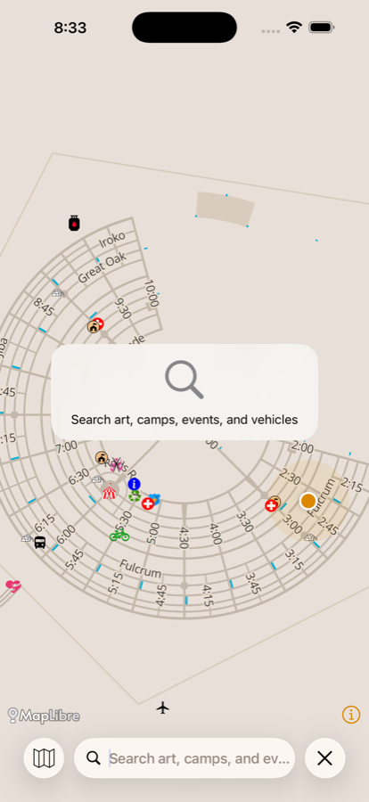 | 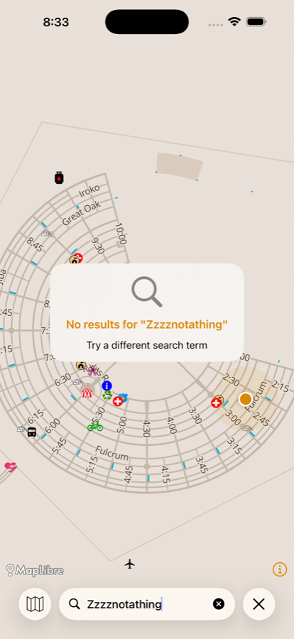 |

| Results | Nearby, from the card |
| --- | --- |
| 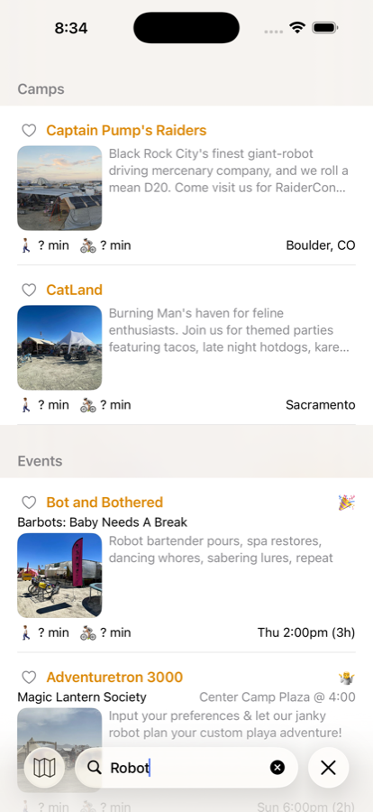 | 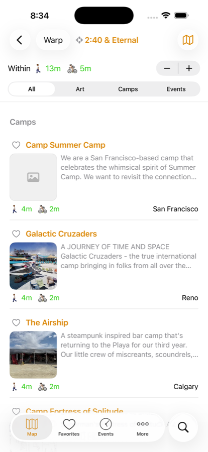 |

## Round 3 (2026-08-07) — seven fixes from the first hands-on pass

### 1. Events gives up the tab, not Nearby

Chris changed his mind after using it: Nearby stays in the tab bar, Events moves to More.
That's the better call — Map / Nearby / Favorites are all "what's around me right now"
surfaces, while Events is the one you go looking for by name, and search plus a More row
both reach it. `TabController.displacedRootIndex` matches the Events root by type.

### 2. More gains an Events row

`MoreViewController.visibleDetailViewRows` shows it only when
`TabController.eventsIsDisplacedFromTabBar` — More is the overflow for browse surfaces
that aren't tabs, so listing Events beside a live Events tab would just be a second path
to one screen. It pushes through `BRCAppDelegate.createEventsViewController()`, the same
factory the tab uses.

Nearby did not get a row: round 2's request for one was about reaching Nearby after it
lost its tab, and it hasn't lost its tab any more.

### 3. The map-snapshot backdrop is gone

It looked right arriving from the Map tab and plainly wrong arriving from anywhere else —
tap Search from Events and you got a frozen map behind the results. Deleted
`MapBackdropStore` and `SearchTabRootViewController`; the search tab is an ordinary opaque
screen again.

The empty states carry it instead: a circled glyph, a title, a sentence on what's
searchable, and an example line ("Try "temple", "pancakes", or "yoga""). The no-results
state got the same treatment. `isOverlay` stays for the `bottomAccessory` layout, which
genuinely does float over a live map.

### 4. Sidebar buttons

44pt → 40pt diameter, 12pt → 18pt spacing, symbols 18pt semibold → 16pt medium. Below the
44pt HIG minimum, deliberately; the extra spacing buys back the miss-tolerance and three
44pt glass circles read as a slab against the map.

### 5. Nearby card content and density

Was name + blurb. Now name, then **time** for events, then **location** with a pin glyph,
falling back to the blurb only when the embargo hides the address. Addresses come from a
new `NearbyItem.address`, gated per type — `canShowArtLocations()` / `canShowCampLocations()`
for art and camps, `canShowLocation(for:)` for events, which fall back to their free-text
location when they aren't hosted anywhere.

The page dots used to sit alone in an otherwise empty row. The collapse chevron and "See
all" moved onto that line, which reclaims the space and gets the chevron out from where it
floated over the item title.

### 6. The collapse chevron

Was a bare glyph over the card content. Now a 24pt circle with a tinted backing, sitting in
the footer control row where it reads as a deliberate control.

### 7. The card ⇄ pin morph now actually animates

**This one was mis-diagnosed twice before it was measured.** Recording the simulator at
60fps and stepping through frames showed the truth: the old collapse went card → circle
with **zero intermediate frames**. It was never a slow animation, it was a hard cut.

Two things were cutting it, and either alone was enough:

1. **The hosting controller resizes to its content.** `sizingOptions = [.intrinsicContentSize]`
   meant collapsing shrank the host to 56pt in a single Auto Layout pass, clipping the
   animation away.
2. **A paged `TabView` is a UIKit page view controller.** Removing it in an `if`/`else`
   branch swap doesn't animate.

`withAnimation` at the mutation site didn't fix it (verified — still a hard cut). Neither
did `glassEffectID` in a `GlassEffectContainer`; that API pairs two *different* views, and
the removal was the problem.

The fix is to stop swapping views. One surface stays in the hierarchy and interpolates its
frame and corner radius — at 56pt a 28pt radius *is* a circle, so the card's rounded rect
and the pin are the same shape at different values. The card and the pin glyph cross-fade
inside it. Nothing is inserted or removed, so there's nothing to skip. Re-measured at
60fps: a clean ~15-frame morph.

`GlassSurface` lost its namespace/`glassEffectID` and takes a corner radius instead.

#### The touch-handling consequence

Holding the box at card size while the pin is showing leaves a card-sized rectangle of
empty space over the map. `NearbyCardTouchContainer` overrides `point(inside:)` to claim
only the rect the card is actually drawing in — the full box when expanded, a centered
56pt square when collapsed, nothing when there's nothing nearby.

Worth recording honestly: two intermediate measurements said the map had stopped panning
beside the pin, and **both were false negatives** — the probe drags were starting on the
navigation bar, not inside the box. The container is kept anyway, because whether a hosting
view declines touches its content doesn't want is undocumented and version-dependent, and
an undraggable patch of map is an easy regression to ship unnoticed. It states the hit
region rather than inferring it.

### Verified this round

- Tabs are Map / Nearby / Favorites / More + Search; Events absent.
- More → Events pushes the full Events list (day picker, filter, Show Map).
- Card shows name / time / location; footer is chevron · dots · "See all".
- "See all" still pushes Nearby *through* the new touch container.
- Collapse morph re-measured at 60fps — ~15 intermediate frames.
- A drag beside the collapsed pin pans the map.
- Search empty state renders with no map behind it.
- `xcodebuild -scheme iBurn` clean; `iBurnTests` **213 passed**, 0 failed.

| Map | Search, empty | Collapse morph (60fps) |
| --- | --- | --- |
| 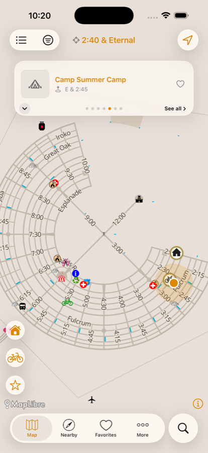 | 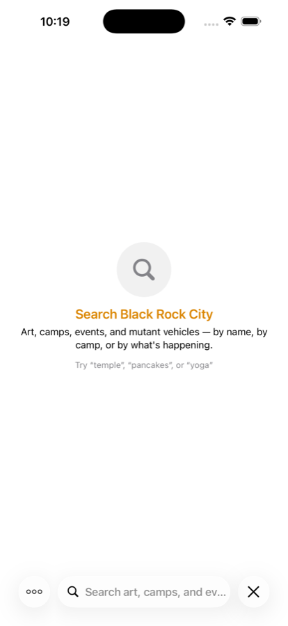 | 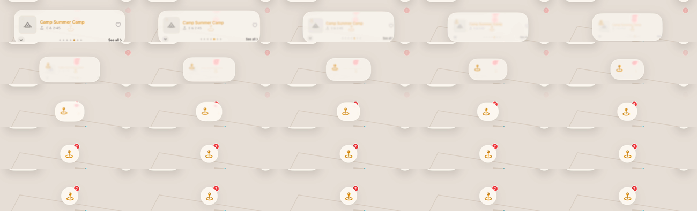 |

### Still open

`.accessibilityHidden(isMinimized)` on the collapsed card doesn't appear to take the card's
buttons out of the accessibility tree — the snapshot still lists "Minimize nearby card" and
"See all nearby" while the pin is showing. Hit-testing *is* correctly disabled (tapping
where they were does nothing), so this is a VoiceOver-only wart, not a functional one.
Worth a look with the Accessibility Inspector before this ships.

## Recommendation

**`searchTab` is the stronger option.** UIKit does the whole job: the tab bar collapses
into a bottom-anchored search field flanked by a back-to-Map button and a Close button,
keyboard tracking included, with zero custom layout code. `bottomAccessory` needed two
non-obvious constraint fixes to get right and still owns a custom activation path.

The cost is the tab slot. **Resolved in round 2:** Nearby gives it up rather than More, and
moves onto the map's nearby card. That reads better than the original More-in-the-nav-bar
plan — the card was already showing nearby content, so the link has somewhere natural to
live, and every screen keeps a tab-bar entry point.

## Follow-ups if this lands

- Delete `BRCUserTrackingBarButtonItem.{h,m}`, its `#import` in
  `iBurn-Bridging-Header.h:25`, and `UserTracking.xcassets` — all now unused. Left in place
  here to keep the prototype reversible.
- `SidebarButtonsView.ButtonType` still carries `.search`, `.potty`, and `.medical` cases
  that aren't in `allTypes`. The dead `searchAction` hook was removed; the unused cases
  were trimmed to the three that render.
- `Appearance.applyTransparentTabBarAppearance` forces `isTranslucent` and a custom
  `UITabBarAppearance`; it doesn't currently fight the accessory, but it's the most likely
  source of trouble if bar theming changes. See `Docs/2026-01-10-liquid-glass-support-plan.md`.
- Decide whether the layout preference survives at all, or whether the winner just becomes
  the unconditional behavior.

## Cross-references

- `Docs/2026-01-10-liquid-glass-support-plan.md` — the broader glass plan for nav/tab bars.
- `Docs/2026-05-30-nearby-card-on-map.md` — the nearby card this had to make room for.
- `.claude/skills/drive-app/references/flows.md` — flow 8 (Feature Flags) now includes the
  Map Search Layout picker.
